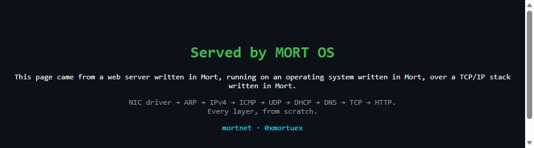

# mortnet

> A web server written in my own language, running on an OS written in my own language, over a TCP/IP stack written in my own language.

**mortnet** is a network stack for [MORT OS](https://github.com/0xmortuex/MortOS), written from scratch in [Mort](https://github.com/0xmortuex/Mort). No lwIP port, no borrowed stack, no library — every byte from the Ethernet frame up gets parsed by code I wrote, in a language I wrote.

**Status: complete** ✅ · M0 → M6, all seven milestones · started &amp; finished 2026-07-21

This is the page MORT OS serves over HTTP, on its own TCP/IP stack — the whole staircase in one screenshot:



<sub><code>curl http://localhost:8080/</code> → MORT OS accepts the connection (a passive-open TCP handshake), reads the <code>GET</code>, and returns this page with a real <code>Server: mortnet</code> / <code>Content-Length</code> response. The finish line: a web server, an OS, and a TCP/IP stack, all in one language whose compiler is a few thousand lines of Python.</sub>

```sh
python test/run_tests.py         # host: 98 golden checks — endian, checksum, buf, eth,
                                 #   ip, arp, icmp, udp, dhcp, dns, tcp, http, echo-reply
python test/test_pcap_oracle.py  # host: the capture verifier, checked without QEMU
python demo/build_demo.py http      # boot MORT OS as an HTTP server; GET it from the host
python demo/build_demo.py tcp       # M5: open a TCP connection to a host server
python demo/build_demo.py dns       # M4: resolve example.com over DNS
python demo/build_demo.py dhcp      # M3: DHCP DORA handshake (boots with no IP)
python demo/build_demo.py ping      # M2: ARP + ICMP round trip
python demo/build_demo.py capture   # M1: transmit one frame
                                    # needs: pip install ziglang, and qemu-system-i386
```

## On MORT OS, on real hardware

The stack is vendored into [MORT OS](https://github.com/0xmortuex/MortOS) (`net/*.mx`, compiled into the kernel) and driven by two shell commands: `net` brings up the RTL8139 and leases an address over DHCP; `httpd` serves the page on port 80. Build a bootable, USB-writable ISO with `python build.py iso` in the MORT OS repo, write it to a stick (`Rufus`, or `dd if=mort.iso of=/dev/sdX`), and boot a real PC. Verified end to end in QEMU — on both the `-kernel` path and a booted ISO with an emulated RTL8139 — where `net` binds `10.0.2.15` and a host `curl` returns the page.

> **Hardware note.** The driver targets the **RTL8139** NIC. QEMU emulates one; most modern PCs don't have one (they ship RTL8168/8111 or Intel), so on bare metal you need an RTL8139 — a ~$5 PCI card. The OS itself boots and runs on any x86 machine; only the networking is card-specific.

## The staircase

Every milestone ends with something you can *see*. No milestone is done until its demo exists.

- [x] **M0 — Foundations** · packet buffer pools, byte-order helpers, Internet checksum — with golden-packet tests running on the host · *landed 2026-07-21: `net/buf.mx`, `net/endian.mx`, `net/checksum.mx`, 22 checks including a real IPv4 header verifying to `0xB861`*
- [x] **M1 — NIC driver** · RTL8139 in QEMU: MORT OS transmits its first raw Ethernet frame · *landed 2026-07-21: `glue/rtl8139.mx` (PCI enumeration + polled TX), `net/eth.mx` (framing), and the `outl`/`inl` builtins added to [Mort](https://github.com/0xmortuex/Mort) for PCI config access. `python demo/build_demo.py capture` boots the demo kernel in QEMU and verifies the broadcast `MORTNET` frame (EtherType 0x88B5) in `build/capture.pcap` — dissected above.*
- [x] **M2 — ARP + ICMP** · MORT OS answers ARP and ICMP, and completes a ping · *landed 2026-07-21: `net/ip.mx`, `net/arp.mx`, `net/icmp.mx`, and `net/netcfg.mx`'s `net_handle_frame` dispatcher, plus the RX ring in `glue/rtl8139.mx`. Host tests forge a real echo request and assert the reply. `python demo/build_demo.py ping` captures the full ARP + ICMP round trip above.*
- [x] **M3 — IPv4 + UDP + DHCP** · MORT OS gets an IP by itself · *landed 2026-07-21: `net/udp.mx` (pseudo-header checksum) and `net/dhcp.mx` (DORA). Host tests build/parse every message; `python demo/build_demo.py dhcp` boots MORT OS with no address and captures the full handshake above, ending at 10.0.2.15.*
- [x] **M4 — DNS client** · MORT OS resolves hostnames · *landed 2026-07-21: `net/dns.mx` — QNAME label encoding, response parsing with compression-pointer handling, first-A-record extraction. Host tests build a query and parse a golden response; `python demo/build_demo.py dns` resolves example.com live through QEMU's resolver, shown above.*
- [x] **M5 — TCP** · handshake, sequence tracking, teardown — the boss fight · *landed 2026-07-21: `net/tcp.mx` (segment build/parse + pseudo-header checksum) and a connection state machine in `demo/tcp_demo.mx`. Host tests verify the segment layer; `python demo/build_demo.py tcp` has MORT OS connect to a host server through SLIRP, exchange data, and close — the server confirms it received `mortnet\n`. Captured above.*
- [x] **M6 — HTTP/1.1 server** · MORT OS serves a page · *landed 2026-07-21: `net/http.mx` (response builder using Mort string literals) and the passive-open TCP path (LISTEN → SYN_RCVD → ESTABLISHED) in `demo/http_demo.mx`. `python demo/build_demo.py http` boots MORT OS listening on :80 (forwarded to the host's :8080); a real HTTP GET returns the page shown at the top.*

## Architecture

Two layers, deliberately kept apart:

```
        ┌──────────────────────────────────────────────┐
        │  net/   the protocol core (pure Mort)        │
        │  eth · arp · ip · icmp · udp · tcp · http    │
        │  no allocation · no OS calls · packets in,   │
        │  packets out                                 │
        └──────────────────────┬───────────────────────┘
                               │ same code, two homes
              ┌────────────────┴────────────────┐
              │                                 │
   ┌──────────▼──────────┐          ┌───────────▼───────────┐
   │  glue/  MORT OS     │          │  test/  host harness  │
   │  RTL8139 driver,    │          │  mortc → C → runs on  │
   │  IRQs, syscalls,    │          │  my laptop, replaying │
   │  shell commands     │          │  captured .pcap       │
   └─────────────────────┘          │  fixtures             │
                                    └───────────────────────┘
```

The core is **freestanding-safe and host-testable**: because [mortc](https://github.com/0xmortuex/Mort) emits plain C, the exact protocol code that will run inside the kernel also compiles on a normal machine, where golden-packet fixtures (real captured frames) are replayed against the parsers and the TCP state machine. Bugs get caught on my laptop, not on a rebooting kernel.

## Design rules

1. **No dynamic allocation.** Fixed pools and ring buffers — it has to live in a kernel.
2. **Host-tested first.** Every protocol lands with fixture tests before it ever touches MORT OS.
3. **Honest scope.** IPv4 only. ARP, ICMP, UDP, DHCP, DNS, TCP, HTTP/1.1. No IPv6, no TLS — yet.
4. **Every milestone has a demo.** If you can't see it, it didn't happen.

## References

- OSDev wiki — [RTL8139](https://wiki.osdev.org/RTL8139), [Network stack](https://wiki.osdev.org/Network_Stack)
- RFC 826 (ARP) · RFC 791 (IPv4) · RFC 792 (ICMP) · RFC 768 (UDP) · RFC 2131 (DHCP) · RFC 1035 (DNS) · RFC 793 (TCP) · RFC 1945 / 2616 (HTTP)
- Beej's Guide to Network Programming — for the mental model, none of the code

## License

MIT — like [Mort](https://github.com/0xmortuex/Mort) and [MORT OS](https://github.com/0xmortuex/MortOS).
