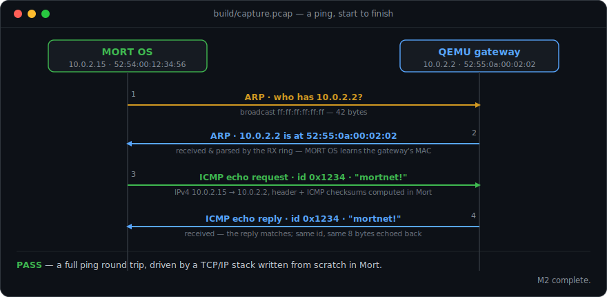

# mortnet

> My portfolio, served by my own web server, running on my own OS, written in my own language, over my own TCP/IP stack, on real hardware.
>
> That's the finish line.

**mortnet** is a network stack for [MORT OS](https://github.com/0xmortuex/MortOS), written from scratch in [Mort](https://github.com/0xmortuex/Mort). No lwIP port, no borrowed stack, no library — every byte from the Ethernet frame up gets parsed by code I wrote, in a language I wrote.

**Status: M2 landed** ✅ · started 2026-07-21 · MORT OS speaks ARP, IPv4 and ICMP — it pings, and it answers pings



<sub>An actual ping, captured from QEMU (`build/capture.pcap`). MORT OS finds the gateway by ARP, then completes an ICMP round trip — the RX ring parses both replies. `net_handle_frame` also answers inbound ARP and pings (proven by host tests against real request bytes).</sub>

```sh
python test/run_tests.py         # host: 57 golden checks (endian, checksum, buf,
                                 #   eth, ip, arp, and a full echo-request -> reply)
python test/test_pcap_oracle.py  # host: the capture verifier, checked without QEMU
python demo/build_demo.py ping      # boot MORT OS in QEMU; ARP + ICMP round trip
python demo/build_demo.py capture   # the M1 demo: transmit one frame
                                    # needs: pip install ziglang, and qemu-system-i386
```

## The staircase

Every milestone ends with something you can *see*. No milestone is done until its demo exists.

- [x] **M0 — Foundations** · packet buffer pools, byte-order helpers, Internet checksum — with golden-packet tests running on the host · *landed 2026-07-21: `net/buf.mx`, `net/endian.mx`, `net/checksum.mx`, 22 checks including a real IPv4 header verifying to `0xB861`*
- [x] **M1 — NIC driver** · RTL8139 in QEMU: MORT OS transmits its first raw Ethernet frame · *landed 2026-07-21: `glue/rtl8139.mx` (PCI enumeration + polled TX), `net/eth.mx` (framing), and the `outl`/`inl` builtins added to [Mort](https://github.com/0xmortuex/Mort) for PCI config access. `python demo/build_demo.py capture` boots the demo kernel in QEMU and verifies the broadcast `MORTNET` frame (EtherType 0x88B5) in `build/capture.pcap` — dissected above.*
- [x] **M2 — ARP + ICMP** · MORT OS answers ARP and ICMP, and completes a ping · *landed 2026-07-21: `net/ip.mx`, `net/arp.mx`, `net/icmp.mx`, and `net/netcfg.mx`'s `net_handle_frame` dispatcher, plus the RX ring in `glue/rtl8139.mx`. Host tests forge a real echo request and assert the reply. `python demo/build_demo.py ping` captures the full ARP + ICMP round trip above.*
- [ ] **M3 — IPv4 + UDP + DHCP** · *demo: MORT OS asks my home router for an IP address and gets one, by itself*
- [ ] **M4 — DNS client** · *demo: `resolve example.com` from the MORT OS shell*
- [ ] **M5 — TCP** · handshake, sliding window, retransmission, teardown — the boss fight · *demo: a Mort program opens a TCP connection to a real server*
- [ ] **M6 — HTTP/1.1 server** · *demo: `curl http://<mortos-ip>/` returns a page — then the portfolio, from real hardware*

## Architecture

Two layers, deliberately kept apart:

```
        ┌──────────────────────────────────────────────┐
        │  net/   the protocol core (pure Mort)        │
        │  eth · arp · ip · icmp · udp · tcp · http    │
        │  no allocation · no OS calls · packets in,   │
        │  packets out                                 │
        └──────────────────────┬───────────────────────┘
                               │ same code, two homes
              ┌────────────────┴────────────────┐
              │                                 │
   ┌──────────▼──────────┐          ┌───────────▼───────────┐
   │  glue/  MORT OS     │          │  test/  host harness  │
   │  RTL8139 driver,    │          │  mortc → C → runs on  │
   │  IRQs, syscalls,    │          │  my laptop, replaying │
   │  shell commands     │          │  captured .pcap       │
   └─────────────────────┘          │  fixtures             │
                                    └───────────────────────┘
```

The core is **freestanding-safe and host-testable**: because [mortc](https://github.com/0xmortuex/Mort) emits plain C, the exact protocol code that will run inside the kernel also compiles on a normal machine, where golden-packet fixtures (real captured frames) are replayed against the parsers and the TCP state machine. Bugs get caught on my laptop, not on a rebooting kernel.

## Design rules

1. **No dynamic allocation.** Fixed pools and ring buffers — it has to live in a kernel.
2. **Host-tested first.** Every protocol lands with fixture tests before it ever touches MORT OS.
3. **Honest scope.** IPv4 only. ARP, ICMP, UDP, DHCP, DNS, TCP, HTTP/1.1. No IPv6, no TLS — yet.
4. **Every milestone has a demo.** If you can't see it, it didn't happen.

## References

- OSDev wiki — [RTL8139](https://wiki.osdev.org/RTL8139), [Network stack](https://wiki.osdev.org/Network_Stack)
- RFC 826 (ARP) · RFC 791 (IPv4) · RFC 792 (ICMP) · RFC 768 (UDP) · RFC 2131 (DHCP) · RFC 1035 (DNS) · RFC 793 (TCP) · RFC 1945 / 2616 (HTTP)
- Beej's Guide to Network Programming — for the mental model, none of the code

## License

MIT — like [Mort](https://github.com/0xmortuex/Mort) and [MORT OS](https://github.com/0xmortuex/MortOS).
